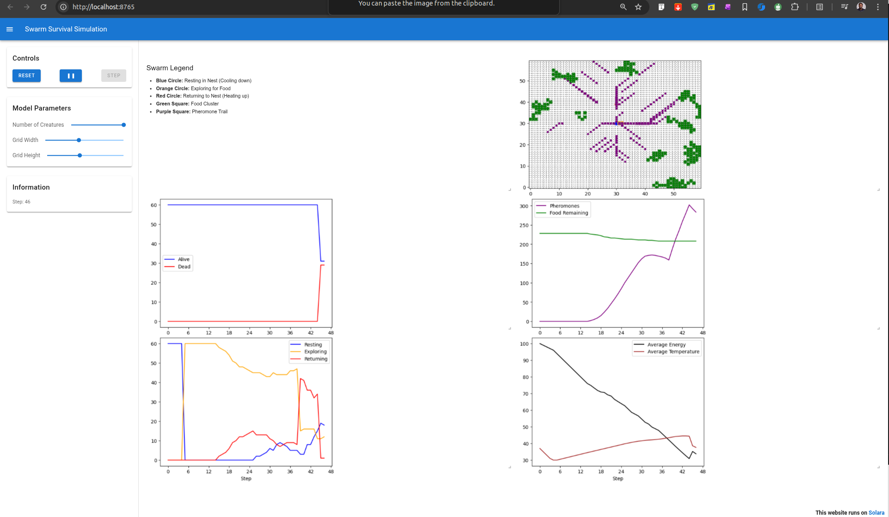

# Swarm Foraging Under Heat and Energy Constraint

This is a Mesa-based swarm model where agents search for food under heat and energy constraints.

## Key Ideas

* Local perception (radius = 1)
* Pheromone-based coordination (stigmergy)
* States: RESTING, EXPLORING, RETURNING

## Model Logic
### 1. Agent State
- **RESTING** : Agent stays at the nest to retain body temperature($T_i$). It then transitions to **EXPLORING** when temperature reaches minimum safe level $T_{min}$
- **EXPLORING** : The agenet searches for food using directional movement (One direction for 4-10 steps) to avoid the inneficiency in random wandering. 
- **RETURNING** : Triggered when food is found or the agent hits the return temperature threshold($T_{return} = 46°C$). 
### 2. Decentralized Coordination (Stigmergy)
 **Pheromone Deposition**  
  When an agent consumes food, the agent estimates local food richness of the area.
- **Weighted Trails**  
  Stronger pheromones are produced for richer food clusters.
- **Trail Following**  
  Nearby exploring agents follow stronger pheromone signals to exploit the known food areas.
### 3. Survival Constraints
- Temperature increases outside the nest
- Temperature decreases inside the nest
- Energy decreases every step
- Additional energy is lost during movement

An agent dies if:
- Energy ≤ 0
- Temperature ≥ critical threshold

## Stigmergy Working


## Comparism Result

Number of Agents	Survival Durations (Steps)
40	                    84
50	                    81
60	                    80


## Setup and running
``` bash
## Requirements
- Python 3.10+
### Create virtual environment
python3 -m venv .venv
source .venv/bin/activate
###  Install dependencies
pip install -r requirements.txt
### run  
solara run create.py
```

## Authors 
- Fahad Ali Jalil
- Chijioke Emem